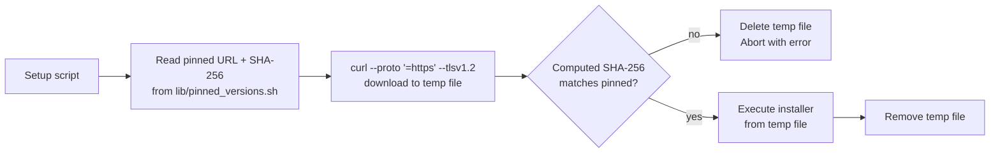

# GRQ-setup

Setup scripts for GRQ (ML Training) cluster nodes on macOS and Ubuntu.

## Initial Setup

1. [Create SSH key](https://docs.github.com/en/authentication/connecting-to-github-with-ssh)
2. `mkdir ~/src && cd ~/src`
3. `git clone git@github.com:stSoftwareAU/GRQ-setup.git`

---

## 🍎 macOS Setup (Primary)

### Automated Setup

Run the primary setup script to configure a Mac Mini cluster node:

```bash
~/src/GRQ-setup/MacOS/setup.sh <mode> <node_number> <automated_password> [create_elephant]
```

**Parameters:**

- `mode`: `local` or `remote` - local mode sets static IP (`10.0.0.<node_number>`), remote mode uses DHCP
- `node_number`: The node number (e.g., 21) - sets hostname to `GRQ-21`
- `automated_password`: Password for automated users (rocket, sloth, optional elephant)
- `create_elephant`: Optional `true` to create elephant user for heavy lift tasks with large removable drives

**Examples:**

```bash
# Local setup with static IP (rocket and sloth only)
~/src/GRQ-setup/MacOS/setup.sh local 21 "your_password"

# Local setup with elephant user for heavy disk tasks
~/src/GRQ-setup/MacOS/setup.sh local 21 "your_password" true

# Remote setup using DHCP
~/src/GRQ-setup/MacOS/setup.sh remote 21 "your_password"
```

**What the setup script does:**

- Sets hostname to `GRQ-<node_number>`
- Configures network:
  - **Local mode**: static IP (`10.0.0.<node_number>`) on primary interface, DHCP on secondary
  - **Remote mode**: DHCP on all interfaces
- Disables sleep and low power modes
- Enables automatic updates
- Configures core dumps (limited to save disk space)
- Installs `jq` (system-wide)
- Installs AWS CLI (system-wide)
- Creates automated users:
  - **rocket**: High performance automated user (high priority daemon)
  - **sloth**: Low priority automated user (low priority daemon)
  - **elephant**: (optional) Heavy lift automated user for large disk tasks
- Installs LaunchDaemon plists for each user:
  - Rocket: High CPU priority (`nice -20`)
  - Sloth: Low CPU priority (`nice 20`)
  - Elephant: Low CPU priority (`nice 20`) - supports removable drive home directories
- Creates per-user setup scripts (`~/setup.sh`) for SSH key generation and GRQ repository setup
- Enables Screen Sharing (Remote Management)

### Adding Users to Existing Machines

To add a user to an existing Mac setup (useful for users with home directories on removable drives):

```bash
~/src/GRQ-setup/MacOS/add-user.sh <username> <node_number> <automated_password>
```

**Parameters:**

- `username`: The username to create/add (e.g., "elephant", "worker")
- `node_number`: The node number (e.g., 21)
- `automated_password`: Password for the user

**Examples:**

```bash
# Add elephant user for heavy disk tasks
~/src/GRQ-setup/MacOS/add-user.sh elephant 21 "your_password"

# Add any other user
~/src/GRQ-setup/MacOS/add-user.sh worker 21 "your_password"
```

**What this script does:**

- Creates the user (or detects if they already exist)
- Reads the user's actual home directory (supports removable drives like `/Volumes/GRQ/Username`)
- Sets up the user's environment script (`~/setup.sh`)
- Installs and starts a LaunchDaemon that runs `<username>.sh` from the user's GRQ directory

**Note:** The daemon runs a script named after the user (e.g., `elephant.sh` for user "elephant", `worker.sh` for user "worker") from `$HOME/GRQ/`.

### Manual Tasks (One-time Setup)

After running `setup.sh`, you must manually enable SSH (Remote Login):

1. Open **System Settings → General → Sharing**
2. Enable **Remote Login**
3. If prompted, allow access for "All Users" (or restrict it to the users you prefer)

**Note:** On macOS Ventura/Sonoma and later, enabling Remote Login requires Full Disk Access privileges for Terminal (this is Apple's security feature). This manual step ensures that SSH is enabled correctly.


### Remote Management & Apple ID Precautions

Each Mac is set up using your Apple ID but does not retain any personal services like Messages, iCloud Drive, or FaceTime. These should be disabled manually after initial setup:

1. Open **System Settings > Apple ID**
2. Sign out of Messages, FaceTime, and iCloud Drive
3. Disable Handoff, Continuity, and Apple Watch unlock

**Remote Access:**

- **Screen Sharing** is enabled and available through your Apple ID or local network
- If a password reset is needed, machines may be wiped and re-setup using `setup.sh`

These systems are designed to be **self-healing and ephemeral** — only syncing training data hourly.

---

## 🐧 Ubuntu Setup

### Automated Setup

Run the setup script to configure an Ubuntu server node:

```bash
~/src/GRQ-setup/Ubuntu/setup.sh <node_number> <automated_password> [create_elephant]
```

**Parameters:**

- `node_number`: The node number (e.g., 21) - sets hostname to `GRQ-21`
- `automated_password`: Password for automated users (rocket, sloth, optional elephant)
- `create_elephant`: Optional `true` to create elephant user for heavy lift tasks

**Examples:**

```bash
# Standard setup (rocket and sloth only)
~/src/GRQ-setup/Ubuntu/setup.sh 21 "your_password"

# Setup with elephant user
~/src/GRQ-setup/Ubuntu/setup.sh 21 "your_password" true
```

**What the setup script does:**

- Sets hostname to `GRQ-<node_number>`
- Updates `/etc/hosts` with hostname entry
- Creates automated users:
  - **rocket**: High performance automated user (normal priority cron)
  - **sloth**: Low priority automated user (low priority cron with `nice`)
  - **elephant**: (optional) Heavy lift automated user (low priority cron with `nice`)
- Installs essential packages: `git`, `openssh-server`, `jq`, `curl`, `htop`, `unzip`, `cron`, `bc`, `rsync`, `build-essential`, `dnsutils`
- Sets timezone to `Australia/Sydney`
- Enables and starts SSH server
- Creates per-user crontabs with priority settings:
  - Rocket: Normal priority, runs every 5 minutes at :00, :05, :10, etc.
  - Sloth: Low priority (`nice -n19`), runs every 5 minutes at :02, :07, :12, etc. (offset by 2 minutes)
  - Elephant: Low priority (`nice -n19`), runs every 5 minutes at :04, :09, :14, etc. (offset by 4 minutes)
- Creates per-user setup scripts (`~/setup.sh`) for:
  - Deno installation
  - Rust installation
  - SSH key generation
  - GRQ repository setup

**Note:** The machine uses DHCP for networking and relies on hardware-level power failure restart.

---

## Post-Setup Steps

After running either setup script, login as each automated user and run:

```bash
~/setup.sh
```

This will:

- Install Rust toolchain (macOS) or Deno and Rust (Ubuntu)
- Generate SSH keys
- Configure git
- Clone the GRQ repository
- Set up environment variables

**Important:** You'll need to add the SSH public key to GitHub when prompted during the setup script execution.

---

## Supply-chain hardening for external installers

Every external installer this repository fetches at provisioning time is now
pinned to a specific commit SHA / version and SHA-256-verified before
execution (issue #16). The previous `curl ... | sh` pattern was vulnerable to
any transient compromise of the upstream installer or the TLS path — a single
attacker-controlled byte would run with full admin privileges on the GRQ node.

Pinned installers:

| Installer | Pinned by | Verified |
| --- | --- | --- |
| Homebrew (`Homebrew/install`) | commit SHA in URL | SHA-256 of `install.sh` |
| rustup (`sh.rustup.rs`) | SHA-256 of installer script | yes |
| Deno (`deno.land/install.sh`) | SHA-256 of installer script | yes |

All pinned hashes live in [`lib/pinned_versions.sh`](lib/pinned_versions.sh)
and the verification helper in [`lib/verify_installer.sh`](lib/verify_installer.sh).
The per-user `~/setup.sh` scripts generated for `rocket` / `sloth` /
`elephant` carry an inline copy of the verifier so they remain self-contained
when the user has no checkout of `GRQ-setup`.



To refresh a pinned hash:

1. Read the upstream change (diff the new installer against the prior pinned version) and confirm it is benign.
2. Compute the new SHA-256: `curl -fsSL <URL> | shasum -a 256` (macOS) or `| sha256sum` (Linux).
3. Update the variable in `lib/pinned_versions.sh` in a PR alongside an audit summary. Never bump automatically.

---

## SSH host-key pinning for the admin LAN

Every provisioned node bootstraps onto the GRQ admin LAN by SSHing to
`10.0.0.11` and `10.0.0.89`. Earlier revisions accepted the host key on first
connection via TOFU — an attacker who ARP-spoofed those addresses on the
`10.0.0.0/24` subnet could intercept the bootstrap (issue #17).

The fix pre-distributes a verified host-key list in
[`lib/admin_known_hosts`](lib/admin_known_hosts). Each parent setup script
copies it to `/etc/ssh/ssh_known_hosts` (root-owned, `0644`), and the
generated per-user `~/setup.sh` calls `ssh-copy-id` and `ssh` with:

```bash
-o StrictHostKeyChecking=yes -o UserKnownHostsFile=/etc/ssh/ssh_known_hosts
```

The `-f` flag was also dropped from `ssh-copy-id` so any future host-key
change is surfaced as an error instead of silently overwriting the pin.

### Populating `lib/admin_known_hosts` (one-time, by the admin)

1. From the admin console you physically trust, run on each admin host:

   ```bash
   for f in /etc/ssh/ssh_host_*_key.pub; do ssh-keygen -lf "$f"; done
   ```

   Record each printed **fingerprint** out of band (paper, sealed channel).

2. From a trusted machine on the LAN, run:

   ```bash
   ssh-keyscan -t ed25519,rsa 10.0.0.11 10.0.0.89
   ```

   Pipe the output through `ssh-keygen -lf -` and compare each fingerprint
   against the value recorded in step 1.

3. Only if every fingerprint matches, paste the `ssh-keyscan` output into
   `lib/admin_known_hosts`, replacing the placeholder lines. Commit the
   change in a dedicated PR with an audit summary in the body.

A mismatch is a potential MITM. Stop, investigate the admin hosts, and
do not re-pin until the discrepancy is explained.
