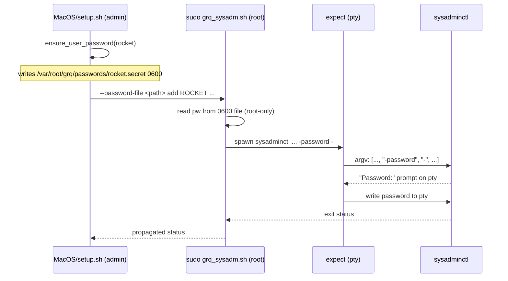

## Summary

Fixed the argv-exposure leak in the macOS provisioning path: `sudo
sysadminctl -addUser ... -password "$pw" ...` and `-resetPasswordFor
... -newPassword "$pw" ...` baked the per-user password into the
spawned process's argv, where `ps -ef`, `/proc/<pid>/cmdline` and
`proc_pidinfo` make it world-readable to every local user. A new
root-only helper `lib/grq_sysadm.sh` now drives `sysadminctl` in
interactive mode (`-password -` / `-newPassword -`) under
`/usr/bin/expect`, feeding the password over a pty so it never reaches
any argv. The Ubuntu path was already safe (chpasswd stdin pipe); only
a static regression check was added there. Closes #15.

## Evidence

`tests/sysadm_argv_test.sh` exercises the helper with a mocked
`sysadminctl` binary, captures its recorded argv, and asserts the
password only appears in the pty-delivered prompt response — never as
a command-line argument. The static checks confirm the parent scripts
no longer match the `-password "$..."` / `-newPassword "$..."`
patterns.

Full `./quality.sh` run is green:

- `tests/verify_installer_test.sh` 22/22
- `tests/generated_user_setup_test.sh` 23/23
- `tests/heredoc_render_test.sh` 7/7
- `tests/ssh_tofu_test.sh` 21/21
- `tests/per_user_password_test.sh` 28/28 (one assertion relaxed to
  accept either `get_or_create_user_password` or the new
  `ensure_user_password` wrapper; change documented in-line)
- `tests/sysadm_argv_test.sh` 22/22 (new)

This is a backend / shell-script change — no UI to screenshot.

## Test Plan

- Added `tests/sysadm_argv_test.sh` with:
  - Static checks that `MacOS/setup.sh` and `MacOS/add-user.sh` invoke
    `lib/grq_sysadm.sh` and no longer carry `-password "$..."` /
    `-newPassword "$..."` patterns.
  - Static check that `Ubuntu/setup.sh` still uses the chpasswd stdin
    pipe and never puts the password on chpasswd's argv.
  - Functional check that drives `lib/grq_sysadm.sh add` / `reset`
    against a mocked `sysadminctl` binary, captures its argv, and
    asserts the secret was delivered only over the pty (the `-`
    sentinel is on argv; the secret is not).
  - Rejection of password files that are not mode `0600`, missing
    password files, and unknown subcommands.
  - Functional check for the new `ensure_user_password` helper.
- Updated `tests/per_user_password_test.sh` to accept either
  `get_or_create_user_password` or `ensure_user_password` in the
  macOS scripts (the macOS path now delegates to the wrapper which
  internally calls the original helper but discards the password
  string). The change is documented in-line, and the original
  assertions covering the absence of `$AUTOMATED_PASSWORD` patterns
  are unchanged.
- Registered the new test in `quality.sh` and added
  `lib/grq_sysadm.sh` / `tests/sysadm_argv_test.sh` to the
  `bash -n` and `shellcheck` lists.
