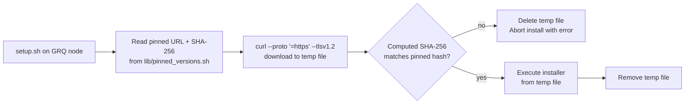

## Summary

Pinned every external installer that `MacOS/setup.sh`, `MacOS/add-user.sh`,
and `Ubuntu/setup.sh` fetch at provisioning time, and SHA-256 verifies the
downloaded script before executing it. The previous unauthenticated
`curl ... | sh` pattern handed full root-on-mismatch to anyone who briefly
compromised Homebrew/install, `sh.rustup.rs`, `deno.land/install.sh`, or the
TLS path between the GRQ node and those endpoints. Closes #16.

Changes:

- New `lib/verify_installer.sh` — `compute_sha256`, `verify_sha256`,
  `download_and_verify` helpers. Cross-platform (`shasum -a 256` on macOS,
  `sha256sum` on Linux). `download_and_verify` fetches with strict TLS
  (`--proto '=https' --tlsv1.2`), checks SHA-256, deletes the temp file on
  mismatch, and refuses to execute.
- New `lib/pinned_versions.sh` — pinned commit SHA + SHA-256 for Homebrew
  (`5753984…/install.sh` → `f3e91784…`), rustup (`6c30b75a…`), and Deno
  (`83f19ea1…`). Documented refresh procedure (never bump automatically).
- `MacOS/setup.sh` — Homebrew installer is now downloaded to a temp file,
  verified, then executed; no more `bash -c "$(curl …/HEAD/install.sh)"`.
  The heredoc that generates per-user `~/setup.sh` embeds a self-contained
  `_grq_verify_install` helper plus the pinned rustup URL/hash.
- `MacOS/add-user.sh` — same heredoc hardening for the rustup install.
- `Ubuntu/setup.sh` — same heredoc hardening for both the Deno and rustup
  installs.
- `quality.sh` — local gate that runs `bash -n`, `shellcheck` (errors only),
  `markdownlint-cli2`, and the three test files.
- `README.md` — new "Supply-chain hardening" section with a Mermaid flow
  diagram and the refresh procedure.

The per-user `~/setup.sh` scripts run on automated users that have no
GRQ-setup checkout, so the verifier is embedded inline in their heredoc
bodies rather than sourced from a sibling file.

## Evidence

CLI/security change, no UI. Verified locally with `./quality.sh < /dev/null`:

```text
[quality] bash -n on shell sources
[quality] shellcheck (errors only)
[quality] markdownlint-cli2
Summary: 0 error(s)
[quality] tests/verify_installer_test.sh         Pass: 22  Fail: 0
[quality] tests/generated_user_setup_test.sh     Pass: 23  Fail: 0
[quality] tests/heredoc_render_test.sh           Pass: 7   Fail: 0
[quality] all quality checks passed
```

Behaviour flow after this PR:



A compromise of Homebrew/install, sh.rustup.rs, deno.land, or the TLS path
during a provisioning run is now a fail-closed event: the SHA-256 mismatch
aborts the install instead of silently handing root to attacker-controlled
bash.

## Test Plan

- `tests/verify_installer_test.sh` — 22 assertions covering
  `compute_sha256` against a known fixture, `verify_sha256` accept/reject,
  `download_and_verify` (with a stubbed `curl`) accept/reject/cleanup, the
  shape of every pinned hash, and grep-audits that confirm no
  `curl ... | sh` or `bash -c "$(curl …)"` patterns and no `/HEAD/`
  Homebrew references remain in any of the three setup scripts.
- `tests/generated_user_setup_test.sh` — 23 assertions confirming each
  parent script sources `lib/pinned_versions.sh`, embeds the
  `_grq_verify_install` helper, references the pinned URL/hash variables,
  and removed the old unpinned pipe-to-sh literals. Also asserts
  `MacOS/setup.sh` verifies Homebrew before executing it.
- `tests/heredoc_render_test.sh` — 7 assertions that render the user-setup
  heredoc with `NODE_NUMBER=42` and the pinned variables and confirm the
  pinned URL/hash literals land in the generated `~/setup.sh`.
