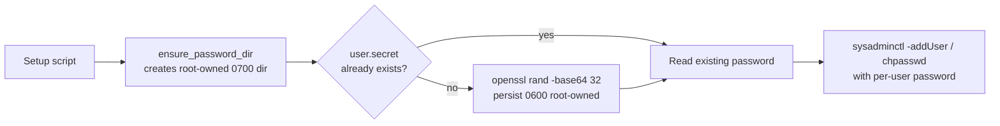

## Summary

Replaces the single shared `$AUTOMATED_PASSWORD` previously applied to
every automated user account (`rocket` / `sloth` / optional `elephant`)
with a per-account random password generated in-script and persisted in
a root-owned `0600` file. Disclosure of the old shared password from
any one channel handed the attacker every other automated account on
the node — see issue #18 for the full attacker model. Closes #18.

The shared `<automated_password>` positional argument is retained as a
no-op slot on every setup script CLI so existing callers do not break;
the script prints a deprecation notice if a non-empty value is passed.

## Evidence

This is a backend / CLI change with no web interface, so there is no
screenshot. Behaviour is verified by the new test suite plus the
existing quality gate (lint, shellcheck, markdownlint, all four
pre-existing test suites, plus the new `per_user_password_test.sh`).

`./quality.sh` output:

```text
Pass: 28  Fail: 0
[quality] all quality checks passed
```

### Architecture



Password store locations:

| Platform | Password store path                     | Ownership    |
| -------- | --------------------------------------- | ------------ |
| macOS    | `/var/root/grq/passwords/<user>.secret` | `root:wheel` |
| Ubuntu   | `/var/lib/grq/passwords/<user>.secret`  | `root:root`  |

## Test Plan

- New library `lib/per_user_password.sh` providing `ensure_password_dir`
  and `get_or_create_user_password` helpers, parameterised via
  `GRQ_PASSWORD_DIR`, `GRQ_PASSWORD_OWNER`, `GRQ_SUDO` so the helpers
  can be exercised unprivileged in tests.
- New test file `tests/per_user_password_test.sh`:
  - Functional tests against the helper library (sources the lib and
    calls the real functions against a tmpdir with `GRQ_SUDO=""`):
    - `ensure_password_dir` creates the directory
    - `get_or_create_user_password` returns a non-empty password on
      first call and the same password on subsequent calls (idempotent)
    - the persisted file is created with mode `600`
    - distinct users (`rocket`, `sloth`, `elephant`) receive distinct
      passwords
    - an empty username argument is rejected
  - Static regression checks on the three parent setup scripts:
    - each sources `lib/per_user_password.sh`
    - each calls `get_or_create_user_password`
    - no script still passes the shared `$AUTOMATED_PASSWORD` to
      `sysadminctl -addUser`, `sysadminctl -resetPasswordFor`, or
      `chpasswd`
    - each script references its platform-appropriate password store path

- `quality.sh` updated to include the new lib and new test file in the
  bash-syntax, shellcheck, and test phases.
- All five existing test suites continue to pass.

### Backwards compatibility

The CLI signature of every script keeps its positional argument count.
Callers that pass `"some_password"` see a deprecation notice and the
value is discarded; first-rerun migration logic in each script applies
the freshly generated per-user password to any pre-existing accounts
(once), then subsequent reruns are no-ops. To rotate a user's password,
delete the relevant `<user>.secret` file under the platform's password
store and rerun the setup script.
