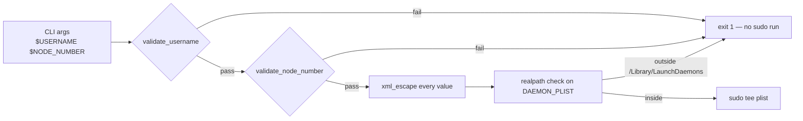

# Validate `$USERNAME` and `$NODE_NUMBER` CLI args; XML-escape plist bodies

## Summary

`MacOS/add-user.sh` interpolated `$USERNAME` directly into a LaunchDaemons
plist path and the plist's XML body without validation. An operator who
could influence the `USERNAME` argument (e.g. via an unattended
provisioning wrapper that takes it from a config file or remote API)
could either path-traverse the `sudo tee` write out of
`/Library/LaunchDaemons/`, or inject XML to override
`<key>UserName</key><string>root</string>` and have the daemon run as
root at next boot.

This change adds `lib/input_validation.sh` with `validate_username`,
`validate_node_number`, and `xml_escape`, and wires them into
`MacOS/add-user.sh` and `MacOS/setup.sh`:

- `USERNAME` must match `^[a-z][a-z0-9_-]{0,30}$` — rejected before any
  `sudo` / `sysadminctl` call.
- `NODE_NUMBER` must match `^[0-9]+$` (rejected in both scripts).
- Plist heredocs route every interpolated value through `xml_escape`
  (defence in depth: even though `$USERNAME` is now allowlisted,
  `USER_HOME` / `ELEPHANT_HOME` come from `dscl` and are mutable by a
  root-equivalent caller).
- `MacOS/add-user.sh` additionally refuses to write `$DAEMON_PLIST` if
  its canonical path is not `/Library/LaunchDaemons/<label>.plist`.

Closes #19.

## Evidence

This is a backend/CLI hardening change with no web interface, so no
screenshot. Verified via:

- Local `./quality.sh` — all checks pass (`bash -n`, `shellcheck`,
  `markdownlint-cli2`, and all six existing test suites plus the new
  `tests/input_validation_test.sh`).
- The new test exercises the validators with both happy-path inputs and
  the exact attack payloads called out in the issue body
  (`'../../etc/cron.d/x'`,
  `'</string><key>UserName</key><string>root</string>...'`, shell
  metacharacters, newlines).
- The test also runs `MacOS/add-user.sh` end-to-end with a stub `sudo`
  on `PATH` and asserts (a) it exits non-zero on the attack inputs and
  (b) it does **not** invoke `sudo` before validation fires.

## Test Plan

- Added `tests/input_validation_test.sh` (54 assertions) covering:
  - `validate_username` — accepts `rocket`, `sloth`, `a_b`, etc.;
    rejects empty, leading-digit, uppercase, leading-hyphen, overlong,
    path-traversal (`../../etc/cron.d/x`), XML-injection, shell
    metacharacters, embedded newlines.
  - `validate_node_number` — accepts decimal digits; rejects empty,
    signed, hex, decimal, alphanumeric, embedded whitespace/newlines.
  - `xml_escape` — escapes `& < > " '` in the correct order
    (ampersand first to avoid double-escape) and neutralises the
    `</string><key>UserName</key><string>root</string>...` payload.
  - Integration: runs `MacOS/add-user.sh` with a stub `sudo` and
    confirms attack inputs exit 1 before any sudo invocation.
- Wired the new test and `lib/input_validation.sh` into
  `quality.sh` (`bash -n`, `shellcheck`, and a dedicated test step).
- All existing tests still pass.
