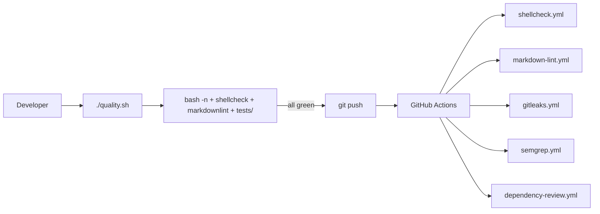

## Summary

Refreshed the project documentation so the README reflects the
hardening, testing, and CI surfaces that have landed since it was last
updated. Adds a Development & Testing section covering `./quality.sh`,
the `tests/` suite, and the workflows under `.github/workflows/`;
documents the `lib/input_validation.sh` helper (issue #19) that was
previously undocumented; and tidies stale PR summary files out of
`docs/` root into the canonical archive at
`docs/archive/pr-summaries/` per Issue #2173. Closes #27.

## Evidence

This is a documentation-only change with no UI surface — verification
is via the test added below and the local quality gate (all 8 new
assertions pass; full gate green).

```text
[quality] tests/readme_documentation_test.sh
  ok   - README references quality.sh
  ok   - README mentions markdownlint check
  ok   - README references the tests directory
  ok   - README references CI workflows directory
  ok   - README mentions ShellCheck CI workflow
  ok   - README references lib/input_validation.sh
  ok   - README references the PR summary archive path
  ok   - no stale pr-summary-*.md files in docs/ root
Pass: 8  Fail: 0
[quality] all quality checks passed
```



## Test Plan

- Added `tests/readme_documentation_test.sh` — asserts the README
  references `quality.sh`, `markdownlint`, the `tests/` directory,
  `.github/workflows`, the `ShellCheck` workflow, the
  `lib/input_validation.sh` helper, and the canonical
  `docs/archive/pr-summaries` path, and that no stale
  `docs/pr-summary-*.md` files remain in `docs/` root.
- Wired the new test into `quality.sh` and the `bash -n` syntax
  sweep so it runs on every local quality gate invocation.
- Moved nine stale `docs/pr-summary-*.md` files into
  `docs/archive/pr-summaries/` (git history preserved via `git mv`).
- Re-ran `./quality.sh < /dev/null` end-to-end — all checks green
  (bash syntax, shellcheck, markdownlint, every test file).
