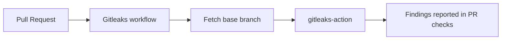

## Summary

Added the **Gitleaks Secrets Detection** GitHub Actions workflow at `.github/workflows/gitleaks.yml`, matching the template in the issue. The workflow scans every pull request diff for committed secrets using `gitleaks-action`, with third-party actions pinned to 40-character commit SHAs (Issue #1756) so a hijacked tag cannot exfiltrate CI secrets. Closes #6.

## Evidence

This is a CI/workflow-only change with no web interface to screenshot. Validation performed:

- YAML parsed successfully with `python3 -c "import yaml; yaml.safe_load(...)"`.
- Workflow structure mirrors the existing `semgrep.yml` and `dependency-review.yml` (same `on:` and `permissions:` shape).
- Third-party actions are pinned by full commit SHA (`actions/checkout@11bd71...`, `gitleaks/gitleaks-action@ff98106e...`).
- A `Fetch base branch` step ensures `gitleaks-action`'s commit-range computation resolves on the runner.

## Test Plan

- [x] YAML syntax validated with a Python YAML parser.
- [ ] Workflow run will be observable on the first PR after merge to `Develop`.
- [ ] `GITLEAKS_LICENSE` org secret must be configured for repos under `stSoftwareAU/*`; without it `gitleaks-action` exits with `ErrLicense` before scanning.
