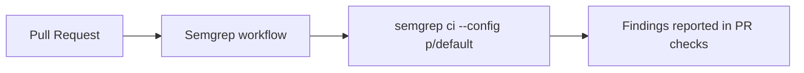

## Summary

Added the **Semgrep SAST Scanning** GitHub Actions workflow at `.github/workflows/semgrep.yml`, matching the template in the issue. The workflow runs on every pull request and scans the codebase using Semgrep's default ruleset, improving the repository's security posture. Closes #7.

## Evidence

This is a CI/workflow-only change with no web interface to screenshot. Validation performed:

- YAML parsed successfully with `python3 -c "import yaml; yaml.safe_load(...)"`.
- Workflow structure mirrors the existing `dependency-review.yml` (same `on:` and `permissions:` shape).
- The job will execute on `pull_request` events once merged into the default branch.

## Test Plan

- [x] YAML syntax validated with a Python YAML parser.
- [ ] Workflow run will be observable on the first PR after merge to `Develop`.
- [ ] If `SEMGREP_APP_TOKEN` is configured at the repository or org level, results are also uploaded to Semgrep Cloud; otherwise the scan still runs and reports findings in the action log.
