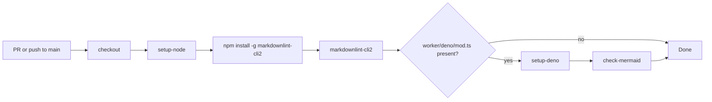

## Summary

Added the Markdown Lint GitHub Actions workflow (`.github/workflows/markdown-lint.yml`) so every pull request and push to the default branch is linted with `markdownlint-cli2`. Added a relaxed `.markdownlint-cli2.jsonc` config so the existing docs pass cleanly, and tightened a handful of structural issues (blank lines around lists and fenced code blocks) in `README.md`. Closes #9.

## Evidence

This is a CI / docs change with no UI surface, so screenshots do not apply. Verified locally by running `markdownlint-cli2` against the repository with the new config:

```text
markdownlint-cli2 v0.22.1 (markdownlint v0.40.0)
Finding: **/*.md !node_modules !.git
Linting: 2 file(s)
Summary: 0 error(s)
```

Workflow flow:



Pinned third-party actions to commit SHAs as required by the supply-chain guidelines (`actions/checkout@v4`, `actions/setup-node@v4`, `denoland/setup-deno@v2`).

## Test Plan

- Ran `markdownlint-cli2` locally — 0 errors across `README.md` and `docs/pr-summary-8.md`.
- Verified the optional Deno `check-mermaid` step is gated behind a `worker/deno/mod.ts` existence check, so it is skipped in this repo (no worker module) but will activate automatically if one is added later (Issue #1683).
- Confirmed `.markdownlint-cli2.jsonc` is on the worker hidden-file allowlist so it can be committed safely.
